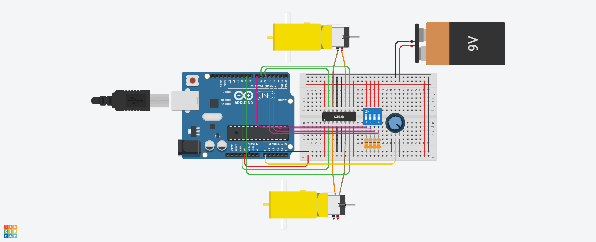

# R3-SoftwareTraining-AndrewGao

TinkerCAD Project Link: https://www.tinkercad.com/things/1ExPsJPXMfo

## Hardware
- Arduino Uno R3
- 9V Battery
- L293D Motor Driver
- Potentiometer
- Hobby Gearmotor (2)
- DIP Switch SPST x4
- 330 ohm Resistor (4)

## Software
- 4 modes for motors to operate controlled by DIP switch (forward, backward, turn right, turn left, stop)
- Motor speed can be varied with potentiometer
- Code is commented for line by line explanation

## Steps
- Created circuit using Tinkercad following the schematic given in the training task pdf
- Programmed Arduino with built-in code editor
- Ran the code and tested circuit

I already had previous experience with arduino code and circuits which made this task much easier to complete. Still made a silly mistake of forgetting to bridge 5V and GND to the opposite rail of the breadboard.
